## 1. Réalisation du cahier des charges

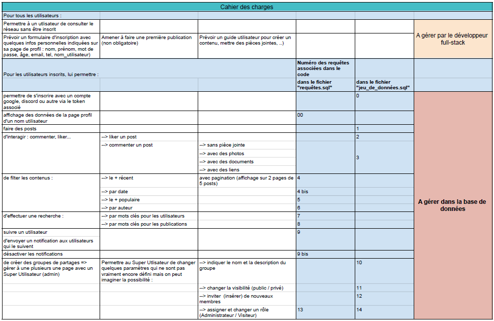

## 2. Validation du cahier des charges
envoi d'un mail à  jean-marc.l@nocturlab.fr pour confirmation de la bonne compréhension de la commande et validation du chaier des charges.

## 3. Génération du fichier de données utilisateurs
 via : https://fr.fakenamegenerator.com/order.php

## 4. Réalisation du MCD via mocodo.net :

    :
    :
    LIER, 01 POST, 0N GROUP
    GROUP : id, name, description, visibility
    PARTAGER, 0N GROUP, 0N ACCOUNT

    ATTACHMENT : id, image, document, link, post_id
    AVOIR, 11 ATTACHMENT, 0N POST
    POST : id, content, account_id, goup_id, date, parent_post
    FAIRE, 0N ACCOUNT, 11 POST
    ACCOUNT : id, name, first_name, age, password, email, tel, user_name, parent_account
    SUIVRE, 0N ACCOUNT, 0N ACCOUNT: notification

    :
    :
    COMMENTER, 0N POST, 01 POST
    LIKE, 0N POST, 0N ACCOUNT
    :

## 5. Réalisation du MLD via drawio

Relation : AVOIR, 11 ATTACHMENT, 0N POST ----> ***one**-to-many
1 POST peut avoir 0, 1 ou plusieures ATTACHMENT
1 ATTACHMENT est lié qu'à **1 seul POST**

Relation : LIER, O1 POST, 0N GROUP ---> many-to-many
1 GROUP peut est lié à 0, 1, ou plusieurs POST
1 POST ne peut être lié qu'à **0 ou 1 seul GROUP**

Relation : PARTAGER, 0N GROUP, 0N ACCOUNT ---> many-to-many
1 GROUP peut être partagé par 0, 1, ou plusieurs ACCOUNT
1 ACCOUNT peut partager dans 0, 1, ou plusieurs GROUP

Relation : FAIRE, 0N ACCOUNT, 11 POST  ---> many-to-**one**
1 ACCOUNT peut faire 0, 1 ou plusieurs POST
1 POST ne peut être fait que par **1 seul ACCOUNT**

Relation : SUIVRE, 0N ACCOUNT, 0N ACCOUNT ---> many-to-many
1 ACCOUNT peut suivre 0, 1, ou plusieurs autres ACCOUNT

Relation : COMMENTER, 0N POST, 01 POST ---> many-to-**one**
1 POST peut commenter que par **1 seul POST**
1 POST peut être commenter par 0, 1, ou N autres POST

Relation : LIKE, 0N POST, 0N ACCOUNT ---> many-to-many
1 POST peut être liker par 0, 1, ou plusieurs ACCOUNT
1 ACCOUNT peut liker 0, 1 ou plusieurs POST

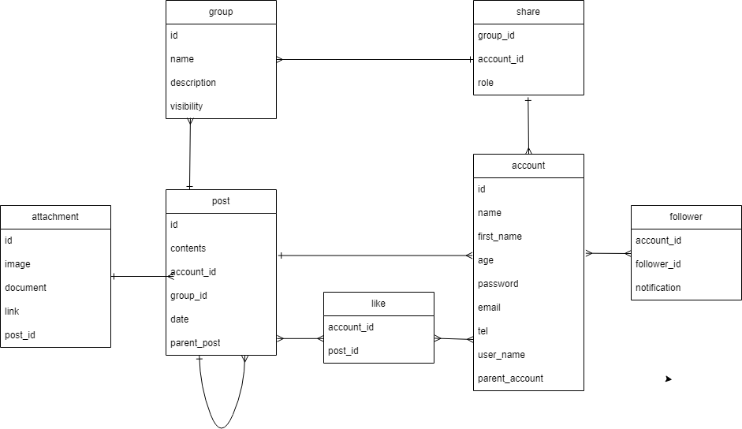

## 6. Réalisation des fichiers : 
- bdd.sql : Tables et tables intermédiares
- jeu_de_données.sql  : insertion de données nécessaires au test des fonctionnalités et des tests
- requetes.sql : requêtes lièes au cahier des charges.

Inscription via un compte Google, discord ...

Requête 1 : insertion de posts 
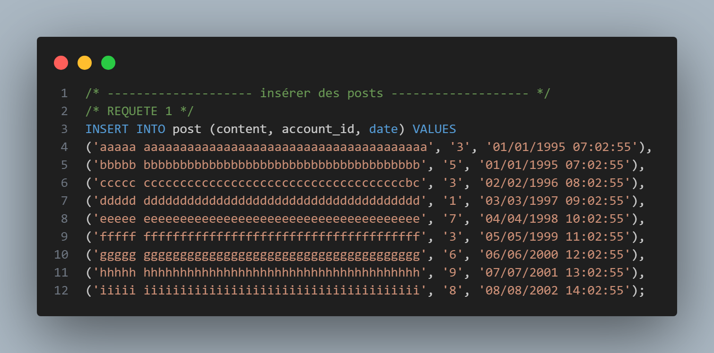

Requête 2 : insertion des likes
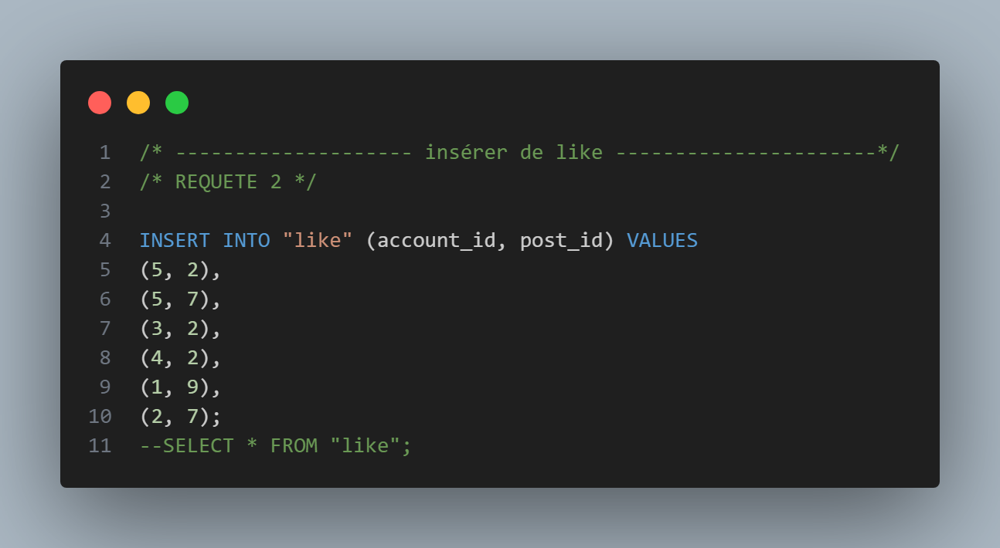

Requête 3 : insertion de commentaires

Requête 4 : trie et filtre des posts par date
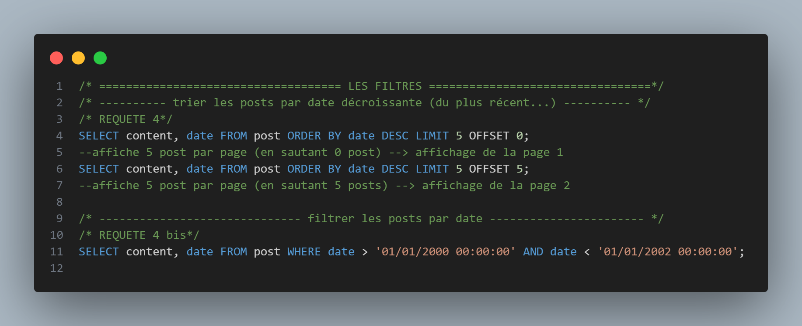

Requête 5 : filtre par popularité
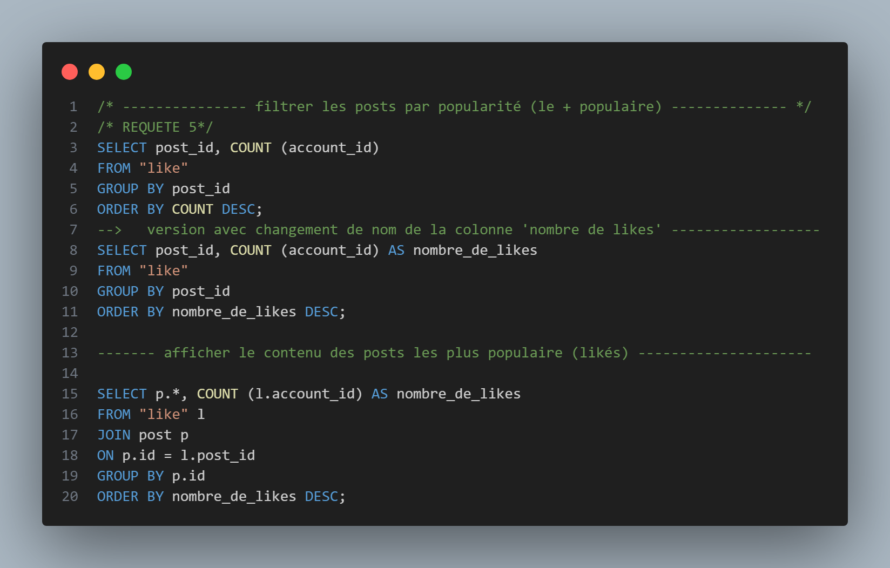

Requête 6 : trie par auteurs, dans l'ordre alaphabétique
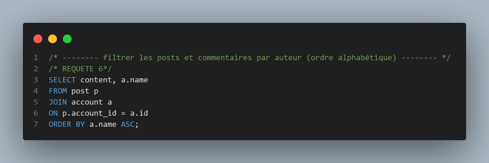

Requête 7 : recherche d'un post via son nom ou pseudo
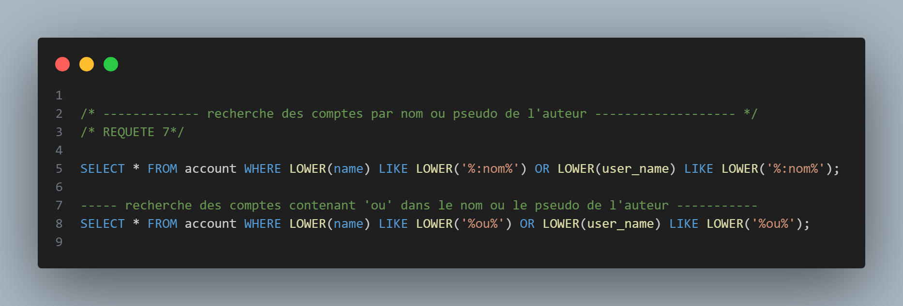

Requête 8 : filtre des posts par mots clés (partie de mots à définir)
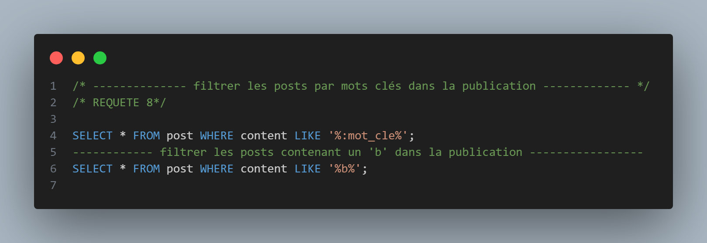

Requête 9 : envoi d'une notification à un auteur lorsqu'il est suivi
            et désactiver lse notifications

Requête 10 : visibilité d'un groupe en 'Public' ou 'Privé'

Requête 11 : changement de visibilité d'un groupe 'Public/Privé'

Requête 12 : inscriptiontion du rôle des membres d'un groupe
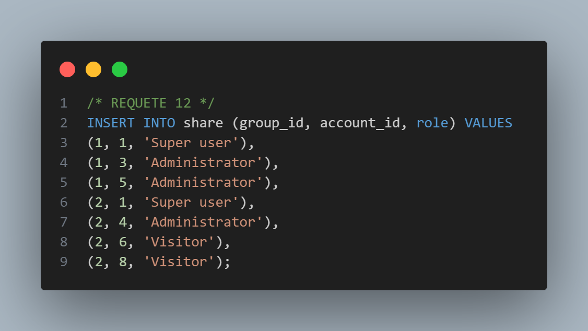

Requête 13 : assignation du rôle d'un membre d'un groupe
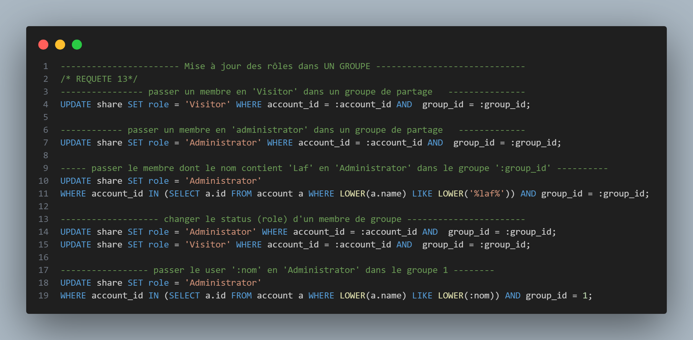

Requête 14 : modification du rôle d'un membre d'un groupe
